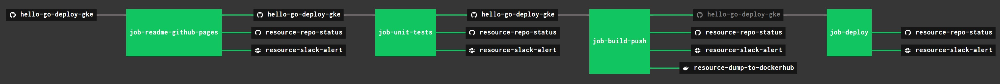

# hello-go-deploy-gke

[](https://goreportcard.com/report/github.com/JeffDeCola/hello-go-deploy-gke)
[](https://godoc.org/github.com/JeffDeCola/hello-go-deploy-gke)
[](https://codeclimate.com/github/JeffDeCola/hello-go-deploy-gke/maintainability)
[](https://codeclimate.com/github/JeffDeCola/hello-go-deploy-gke/issues)
[](http://jeffdecola.mit-license.org)

`hello-go-deploy-gke` _will test, build, push (to DockerHub) and deploy
a long running "hello-world" Docker Image to Google Kubernetes Engine (gke)._

I also have other repos showing different deployments,

* PaaS
  * [hello-go-deploy-aws-elastic-beanstalk](https://github.com/JeffDeCola/hello-go-deploy-aws-elastic-beanstalk)
  * [hello-go-deploy-azure-app-service](https://github.com/JeffDeCola/hello-go-deploy-azure-app-service)
  * [hello-go-deploy-gae](https://github.com/JeffDeCola/hello-go-deploy-gae)
  * [hello-go-deploy-marathon](https://github.com/JeffDeCola/hello-go-deploy-marathon)
* CaaS
  * [hello-go-deploy-amazon-ecs](https://github.com/JeffDeCola/hello-go-deploy-amazon-ecs)
  * [hello-go-deploy-amazon-eks](https://github.com/JeffDeCola/hello-go-deploy-amazon-eks)
  * [hello-go-deploy-aks](https://github.com/JeffDeCola/hello-go-deploy-aks)
  * [hello-go-deploy-gke](https://github.com/JeffDeCola/hello-go-deploy-gke)
* IaaS
  * [hello-go-deploy-amazon-ec2](https://github.com/JeffDeCola/hello-go-deploy-amazon-ec2)
  * [hello-go-deploy-azure-vm](https://github.com/JeffDeCola/hello-go-deploy-azure-vm)
  * [hello-go-deploy-gce](https://github.com/JeffDeCola/hello-go-deploy-gce)

The `hello-go-deploy-gke`
[Docker Image](https://hub.docker.com/r/jeffdecola/hello-go-deploy-gke)
on DockerHub.

The `hello-go-deploy-gke`
[GitHub Webpage](https://jeffdecola.github.io/hello-go-deploy-gke/).

## PREREQUISITES

For this exercise I used go.  Feel free to use a language of your choice,

* [go](https://github.com/JeffDeCola/my-cheat-sheets/tree/master/software/development/languages/go-cheat-sheet)

To build a docker image you will need docker on your machine,

* [docker](https://github.com/JeffDeCola/my-cheat-sheets/tree/master/software/operations-tools/orchestration/builds-deployment-containers/docker-cheat-sheet)

To push a docker image you will need,

* [DockerHub account](https://hub.docker.com/)

To deploy to `gke` you will need,

* [google kubernetes engine (gke)](https://github.com/JeffDeCola/my-cheat-sheets/tree/master/software/service-architectures/containers-as-a-service/google-kubernetes-engine-cheat-sheet)

As a bonus, you can use Concourse CI to run the scripts,

* [concourse](https://github.com/JeffDeCola/my-cheat-sheets/tree/master/software/operations-tools/continuous-integration-continuous-deployment/concourse-cheat-sheet)
  (Optional)

## CREATE A KUBERNETES CLUSTER ON GCE (3 NODES)

Before we can do anything, you need to create a kubernetes cluster on `gce`.
This costs money, so when you're done, you can destroy it.

My script
[create-gke-cluster](https://github.com/JeffDeCola/hello-go-deploy-gke/blob/master/example-01/create-gke-cluster/create-gke-cluster.sh)
fires up an affordable 3-node cluster
`jeffs-cluster-hello-go-deploy-gke`
using small `f1-micro` machines. This should cost under 20 cents for a few hours.

The `f1-micro` machines are really too small for real production, but should
be fine for testing if you only have 1-2 pods.

The script will also authenticate with your cluster.

To destroy cluster,

```bash
gcloud container --project "$GCP_JEFFS_PROJECT_ID" \
    clusters delete jeffs-gke-cluster-hello-go-deploy-gke \
    --zone "us-west1-a"
```

## EXAMPLES

This repo may have a few examples. We will deploy example 1.

### EXAMPLE 1

This program will display a running count on a website.

```bash
Hello, world! - hello-go-deploy-gke example 01 - Using a docker container for gke
The current count is 26
```

To run from the command line,

```bash
go run main.go
```

Check that its working,

```bash
curl localhost:8080"
```

 or

[localhost:8080](http://localhost:8080/)

## STEP 1 - TEST

Lets unit test the code,

```bash
go test -cover ./... | tee /test/test_coverage.txt
```

There is a `unit-tests.sh` script to run the unit tests.
There is also a script in the /ci folder to run the unit tests
in concourse.

## STEP 2 - BUILD (DOCKER IMAGE VIA DOCKERFILE)

We will be using a multi-stage build using a Dockerfile.
The end result will be a very small docker image around 13MB.

```bash
docker build -f build-push/Dockerfile -t jeffdecola/hello-go-deploy-gke .
```

Obviously, replace `jeffdecola` with your DockerHub username.

In stage 1, rather than copy a binary into a docker image (because
that can cause issue), the Dockerfile will build the binary in the
docker image.

If you open the DockerFile you can see it will get the dependencies and
build the binary in go,

```bash
FROM golang:alpine AS builder
RUN go get -d -v
RUN go build -o /go/bin/hello-go-deploy-gke main.go
```

In stage 2, the Dockerfile will copy the binary created in
stage 1 and place into a smaller docker base image based
on `alpine`, which is around 13MB.

You can check and test your docker image,

```bash
docker run -p 8080:8080 --name hello-go-deploy-gke -dit jeffdecola/hello-go-deploy-gke
docker exec -i -t hello-go-deploy-gke /bin/bash
docker logs hello-go-deploy-gke
docker images jeffdecola/hello-go-deploy-gke:latest
```

There is a `build-push.sh` script to build and push to DockerHub.
There is also a script in the /ci folder to build and push
in concourse.

## STEP 3 - PUSH (TO DOCKERHUB)

Lets push your docker image to DockerHub.

If you are not logged in, you need to login to dockerhub,

```bash
docker login
```

Once logged in you can push to DockerHub

```bash
docker push jeffdecola/hello-go-deploy-gke
```

Check you image at DockerHub. My image is located
[https://hub.docker.com/r/jeffdecola/hello-go-deploy-gke](https://hub.docker.com/r/jeffdecola/hello-go-deploy-gke).

There is a `build-push.sh` script to build and push to DockerHub.
There is also a script in the /ci folder to build and push
in concourse.

## STEP 4 - DEPLOY (TO KUBERNETES CLUSTER)

First deploy your docker image on Dockerhub to your cluster
you made above (creates a `workload`),

You can either use kubectl or the yaml configuration file.

Both methods are noted in
[deploy.sh](https://github.com/JeffDeCola/hello-go-deploy-gke/blob/master/example-01/deploy-gke/deploy-gke.sh).

This script will also make a `service`. Services are endpoints
that export ports to the outside world.
Expose port 8080 to the world (This will make an IP address),

Inspect your deployment,

```bash
kubectl get deployments
kubectl get deployment jeffs-web-counter-deployment
```

Delete your deployment,

```bash
kubectl delete deployment jeffs-web-counter-deployment"
```

Inspect your service,

```bash
kubectl get services
kubectl get service jeffs-web-counter-service
```

Delete your service,

```bash
kubectl delete service jeffs-web-counter-service
```

## KUBERNETES DASHBOARD (THIS IS NICE)

If you noticed we used the addon KubernetesDashboard when we created our cluster.

To use, first get a secret token,

```bash
gcloud config config-helper --format=json | jq -r '.credential.access_token'
```

Then run a proxy,

```bash
kubectl proxy
```

And open in a browser and enter your token,

[localhost:8001](http://localhost:8001/api/v1/namespaces/kube-system/services/https:kubernetes-dashboard:/proxy)

## TEST, BUILT, PUSH & DEPLOY USING CONCOURSE (OPTIONAL)

For fun, I use concourse to automate the above steps.

A pipeline file [pipeline.yml](https://github.com/JeffDeCola/hello-go-deploy-gke/tree/master/ci/pipeline.yml)
shows the entire ci flow. Visually, it looks like,



The `jobs` and `tasks` are,

* `job-readme-github-pages` runs task
  [readme-github-pages.sh](https://github.com/JeffDeCola/hello-go-deploy-gke/tree/master/ci/scripts/readme-github-pages.sh).
* `job-unit-tests` runs task
  [unit-tests.sh](https://github.com/JeffDeCola/hello-go-deploy-gke/tree/master/ci/scripts/unit-tests.sh).
* `job-build-push` runs task
  [build-push.sh](https://github.com/JeffDeCola/hello-go-deploy-gke/tree/master/ci/scripts/build-push.sh).
* `job-deploy` runs task
  [deploy.sh](https://github.com/JeffDeCola/hello-go-deploy-gke/tree/master/ci/scripts/deploy.sh).

The concourse `resources type` are,

* `hello-go-deploy-gke` uses a resource type
  [docker-image](https://hub.docker.com/r/concourse/git-resource/)
  to PULL a repo from github.
* `resource-dump-to-dockerhub` uses a resource type
  [docker-image](https://hub.docker.com/r/concourse/docker-image-resource/)
  to PUSH a docker image to dockerhub.
* `resource-marathon` users a resource type
  [docker-image](https://hub.docker.com/r/ckaznocha/marathon-resource)
  to DEPLOY the newly created docker image to marathon.
* `resource-slack-alert` uses a resource type
  [docker image](https://hub.docker.com/r/cfcommunity/slack-notification-resource)
  that will notify slack on your progress.
* `resource-repo-status` uses a resource type
  [docker image](https://hub.docker.com/r/dpb587/github-status-resource)
  that will update your git status for that particular commit.

For more information on using concourse for continuous integration,
refer to my cheat sheet on [concourse](https://github.com/JeffDeCola/my-cheat-sheets/tree/master/software/operations-tools/continuous-integration-continuous-deployment/concourse-cheat-sheet).
